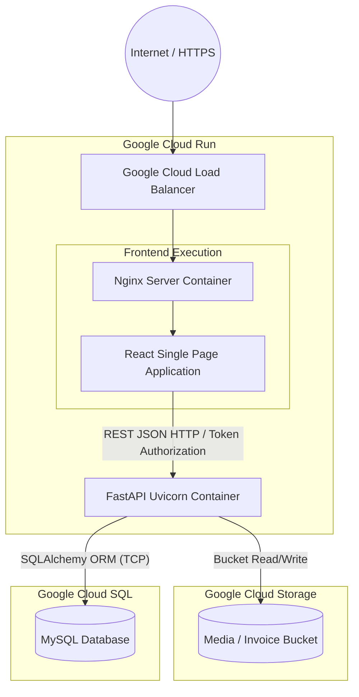
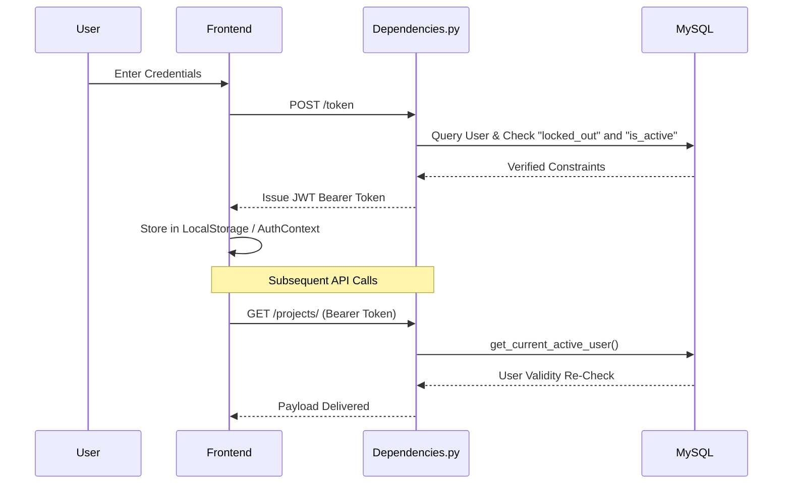
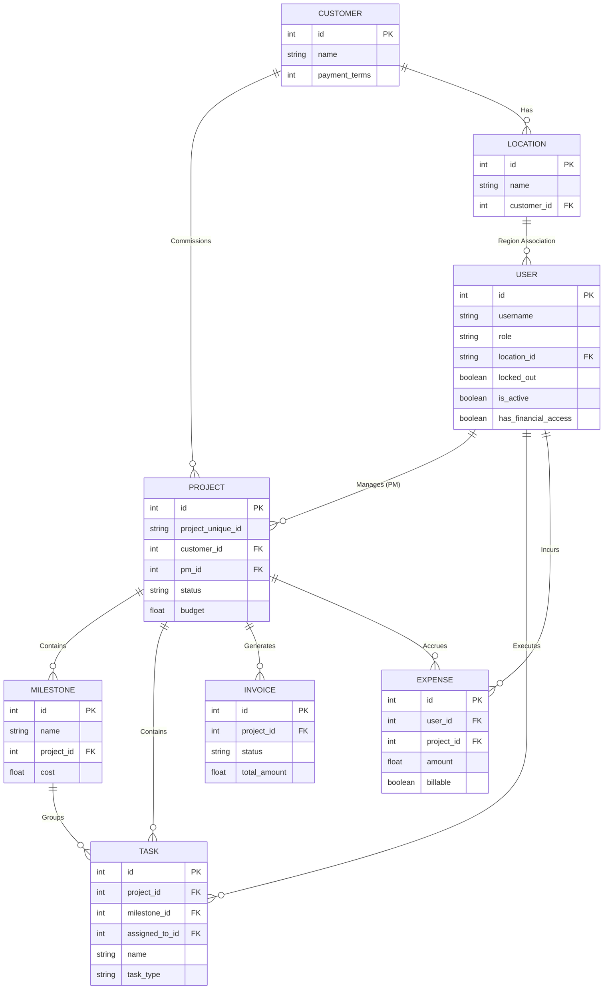
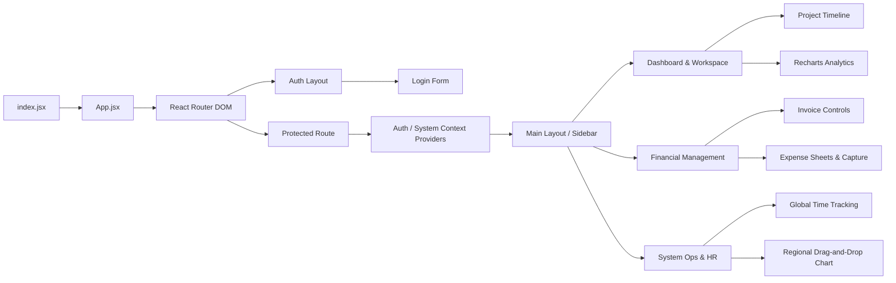

# PACE Application Architecture

This document provides a comprehensive structural mapping of the PACE Application bridging the Nginx React frontend into the Python FastAPI backend, culminating in the database schemas mapping.

## Infrastructure Map (Cloud Deployment)

## Security & Authentication Lifecycle

## Core Relational Map (ERD)

This Entity-Relationship Diagram outlines the operational hierarchies mapping your core Python FastAPI Data Models (`app/models.py`).

## Front-End React Component Matrix

This diagram maps how the React frontend cascades routing properties securely through to the actual operational pages mapping exactly to your active file structure inside `frontend/src/`.

