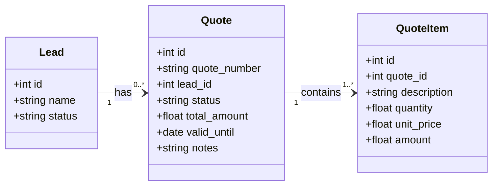

# PACE Codebase Maintenance Log & Quoting System Blueprint

This document identifies structural and code-level gaps in the PACE repository and provides an architectural blueprint for introducing the new **Quoting System** module.

---

## 1. Structural Gaps & Technical Debt Log

Based on our system scan and analysis of the active database schema, we have identified several code quality issues, inconsistencies, and database schema artifacts left behind by the previous developers.

### Issue 1: Root Directory Clutter
* **Detail**: There are over 50 single-use Python helper/migration scripts in the root directory (e.g. `add_column.py`, `add_dept.py`, `alter_db.py`, `migrate_lead_contract.py`, `fix_userlist_bulk.py`).
* **Impact**: Hinders navigation, pollutes the root repository scope, and makes developer onboarding difficult.
* **Remediation Plan**: Move all helper/migration scripts into a `/scripts/migrations/` subdirectory and document their purpose and order of execution in the local playbook.

### Issue 2: SQL Dialect Inconsistency
* **Detail**: References and files for SQLite (`sql_app.db`, `migrate_sqlite.py`) exist alongside the production MariaDB/MySQL models.
* **Impact**: Causes confusion for new developers regarding database engines, schemas, and persistence rules.
* **Remediation Plan**: Deprecate and delete the legacy SQLite configuration code and local SQLite database files, ensuring connection settings enforce MariaDB/MySQL exclusively.

### Issue 3: Duplicate CRUD Definitions in `app/crud.py`
* **Detail**: There are extensive duplicate function definitions in `app/crud.py` resulting from poor version control merges. Nearly 20 core handlers are defined twice:
  - `update_milestone` (defined at L1074 and L1316)
  - `delete_milestone` (defined at L1115 and L1357)
  - `update_line_item` (defined at L1126 and L1394)
  - `delete_line_item` (defined at L1141 and L1409)
  - `get_leads` (defined at L1171 and L1439)
  - `create_lead` (defined at L1182 and L1450)
  - `update_lead` (defined at L1193 and L1461)
  - `delete_lead` (defined at L1229 and L1479)
  - `clone_lead` (defined at L1243 and L1493)
  - `get_comments` (defined at L1266 and L1516)
  - `create_comment` (defined at L1272 and L1519)
  - `get_tasks` (defined at L1280 and L1527)
  - `get_task` (defined at L1305 and L1560)
  - `create_task` (defined at L1569 and L1871)
  - `update_task` (defined at L1591 and L1902)
  - `delete_task` (defined at L1614 and L1932)
  - `clone_task` (defined at L1622 and L1940)
  - `create_task_event` (defined at L1646 and L1965)
  - `update_task_event` (defined at L1664 and L2023)
  - `delete_task_event` (defined at L1676 and L2069)
* **Impact**: Significant risk of silent bugs where changes to one function definition are overridden or ignored because a duplicate definition exists later in the file.
* **Remediation Plan**: Refactor `app/crud.py` to remove duplicate blocks, consolidate logic, and unify standalone/task-bound event creation cleanly.

### Issue 4: Incomplete Settings Error-Handling
* **Detail**: `app/config.py` loads critical integration credentials (e.g., Xero API, MS Graph API) directly into Pydantic `BaseSettings`. If environment variables are missing or invalid, integration routers throw unhandled runtime exceptions.
* **Impact**: Unexpected API crashes and failure states for end-users during third-party integration syncs.
* **Remediation Plan**: Implement early settings verification checks inside `app/main.py` that log clear warnings/errors during backend startup.

### Issue 5: Database Schema Constraint Bloat
* **Detail**: The physical MySQL database schema shows excessive foreign key constraint bloat. Specifically, the `comments` table has over 200 duplicate constraints defined on the `task_id` column (named `comments_ibfk_10` through `comments_ibfk_222` all referencing `tasks.id`).
* **Impact**: Inefficient database schema metadata tracking and potential errors during migration scripts or foreign key cascading operations.
* **Remediation Plan**: Run a cleanup migration to drop the duplicate foreign key constraints on the `comments` table, leaving only a single, clean foreign key reference `comments_ibfk_10` pointing to `tasks.id`.

---

## 2. Quoting System Architectural Blueprint

To support sales pipeline management, we propose adding a new **Quoting System** module. This system will allow users to draft proposals, add line items, send quotes to leads, and automatically compile them into active projects upon client acceptance.

### 2.1 Database Schema Additions (`app/models.py`)

We will define two new relational tables: `quotes` and `quote_items`. Both will inherit from `AuditMixin`.



```python
# app/models.py additions

class QuoteStatus(str, enum.Enum):
    DRAFT = "Draft"
    SENT = "Sent"
    ACCEPTED = "Accepted"
    DECLINED = "Declined"
    EXPIRED = "Expired"

class Quote(Base, AuditMixin):
    __tablename__ = "quotes"
    
    id = Column(Integer, primary_key=True, index=True)
    quote_number = Column(String(50), unique=True, index=True)
    lead_id = Column(Integer, ForeignKey("leads.id"), nullable=True)
    status = Column(String(50), default=QuoteStatus.DRAFT)
    valid_until = Column(Date, nullable=True)
    total_amount = Column(Float, default=0.0)
    notes = Column(Text, nullable=True)
    terms = Column(Text, nullable=True)
    
    lead = relationship("Lead", back_populates="quotes")
    items = relationship("QuoteItem", back_populates="quote", cascade="all, delete-orphan")

class QuoteItem(Base):
    __tablename__ = "quote_items"
    
    id = Column(Integer, primary_key=True, index=True)
    quote_id = Column(Integer, ForeignKey("quotes.id"))
    description = Column(String(500), nullable=False)
    quantity = Column(Float, default=1.0)
    unit_price = Column(Float, nullable=False)
    amount = Column(Float, nullable=False) # Automatically calculated: qty * unit_price
    
    quote = relationship("Quote", back_populates="items")
```

### 2.2 Pydantic Schemas (`app/schemas.py`)

```python
# app/schemas.py additions

from pydantic import BaseModel, Field
from datetime import date
from typing import List, Optional

class QuoteItemBase(BaseModel):
    description: str
    quantity: float = 1.0
    unit_price: float

class QuoteItemCreate(QuoteItemBase):
    pass

class QuoteItem(QuoteItemBase):
    id: int
    quote_id: int
    amount: float

    class Config:
        from_attributes = True

class QuoteBase(BaseModel):
    quote_number: str
    valid_until: Optional[date] = None
    notes: Optional[str] = None
    terms: Optional[str] = None

class QuoteCreate(QuoteBase):
    lead_id: Optional[int] = None
    items: List[QuoteItemCreate]

class QuoteUpdate(BaseModel):
    status: Optional[str] = None
    valid_until: Optional[date] = None
    notes: Optional[str] = None
    terms: Optional[str] = None
    items: Optional[List[QuoteItemCreate]] = None

class Quote(QuoteBase):
    id: int
    lead_id: Optional[int]
    status: str
    total_amount: float
    items: List[QuoteItem]
    created_at: datetime
    updated_at: datetime

    class Config:
        from_attributes = True
```

### 2.3 CRUD Controller Logic (`app/crud.py`)

Add handlers to create, read, update, and delete quotes, plus a trigger logic to convert accepted quotes to projects.

```python
# app/crud.py additions

def get_quote(db: Session, quote_id: int):
    return db.query(models.Quote).filter(models.Quote.id == quote_id).options(
        joinedload(models.Quote.items)
    ).first()

def get_quotes(db: Session, skip: int = 0, limit: int = 100):
    return db.query(models.Quote).options(joinedload(models.Quote.items)).offset(skip).limit(limit).all()

def create_quote(db: Session, quote_in: schemas.QuoteCreate, current_user: models.User):
    # Calculate amounts
    total = 0.0
    db_items = []
    for item in quote_in.items:
        amt = item.quantity * item.unit_price
        total += amt
        db_items.append(models.QuoteItem(
            description=item.description,
            quantity=item.quantity,
            unit_price=item.unit_price,
            amount=amt
        ))
        
    db_quote = models.Quote(
        quote_number=quote_in.quote_number,
        lead_id=quote_in.lead_id,
        valid_until=quote_in.valid_until,
        notes=quote_in.notes,
        terms=quote_in.terms,
        total_amount=total,
        status="Draft",
        created_by_id=current_user.id,
        updated_by_id=current_user.id
    )
    db_quote.items = db_items
    db.add(db_quote)
    db.commit()
    db.refresh(db_quote)
    return db_quote

def convert_quote_to_project(db: Session, quote_id: int, current_user: models.User):
    quote = get_quote(db, quote_id=quote_id)
    if not quote or quote.status != "Accepted":
        raise ValueError("Quote not accepted or not found")
        
    lead = db.query(models.Lead).filter(models.Lead.id == quote.lead_id).first()
    
    # Create Project
    db_project = models.Project(
        project_unique_id=f"P-{quote.quote_number}",
        name=f"Project from Quote {quote.quote_number}",
        description=quote.notes,
        customer_id=lead.customer_id if lead else None,
        lead_id=quote.lead_id,
        budget=quote.total_amount,
        status="active",
        created_by_id=current_user.id,
        updated_by_id=current_user.id
    )
    db.add(db_project)
    db.commit()
    db.refresh(db_project)
    
    # Map quote items to project Milestones
    for idx, item in enumerate(quote.items):
        db_milestone = models.Milestone(
            project_id=db_project.id,
            name=item.description[:250],
            cost=item.amount,
            progress=0,
            milestone_number=idx + 1,
            is_completed=False,
            created_by_id=current_user.id,
            updated_by_id=current_user.id
        )
        db.add(db_milestone)
        
    # Update Lead status
    if lead:
        lead.status = "converted"
        
    db.commit()
    return db_project
```

### 2.4 FastAPI Endpoints (`app/main.py`)

Mount a new router under `app/main.py`:

```python
# API Endpoint declarations in app/main.py

@app.post("/quotes/", response_model=schemas.Quote)
def api_create_quote(quote: schemas.QuoteCreate, db: Session = Depends(get_db), current_user: models.User = Depends(dependencies.get_current_active_user)):
    return crud.create_quote(db, quote, current_user)

@app.get("/quotes/", response_model=List[schemas.Quote])
def api_read_quotes(skip: int = 0, limit: int = 100, db: Session = Depends(get_db)):
    return crud.get_quotes(db, skip=skip, limit=limit)

@app.put("/quotes/{quote_id}", response_model=schemas.Quote)
def api_update_quote(quote_id: int, status: str, db: Session = Depends(get_db), current_user: models.User = Depends(dependencies.get_current_active_user)):
    db_quote = crud.get_quote(db, quote_id)
    if not db_quote:
        raise HTTPException(status_code=404, detail="Quote not found")
    db_quote.status = status
    db_quote.updated_by_id = current_user.id
    db_quote.updated_at = datetime.utcnow()
    db.commit()
    db.refresh(db_quote)
    
    if status == "Accepted":
        crud.convert_quote_to_project(db, quote_id, current_user)
        
    return db_quote
```

### 2.5 React Frontend Interfaces (`frontend/src`)

1. **`frontend/src/pages/QuoteForm.jsx`**:
   - UI to construct a Quote.
   - Dynamic rows for item descriptions, quantity inputs, and unit pricing.
   - Automatically computes total sum via `useMemo`.
2. **`frontend/src/pages/QuoteList.jsx`**:
   - Lists historical quotes with search, sorting, and status-colored tags.
3. **`frontend/src/pages/QuoteDetails.jsx`**:
   - Detail view with "Send Quote" (PDF email generator) and a "Mark Accepted" button that fires the API to convert the Quote into an active Project.
4. **Router Configuration (`frontend/src/App.jsx`)**:
   - Register pathways: `/portal/quotes`, `/portal/quotes/new`, `/portal/quotes/:id`.
5. **Navigation Link (`frontend/src/components/Layout.jsx`)**:
   - Add a sidebar navigation item "Quotes" visible to PMs and Administrators.
